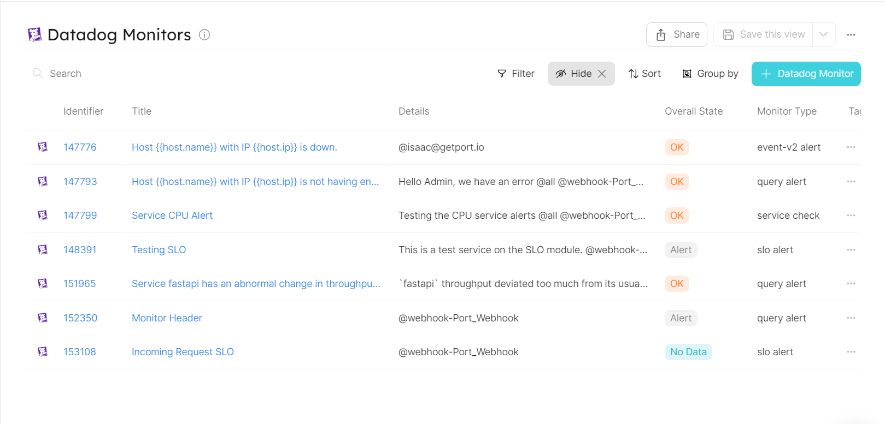

# Ingesting Datadog Monitors

## Getting started

In this example you will create a`datadogMonitor` blueprint that ingests all monitors from your Datadog account using REST API. Then you will add some Python code to create new entities in Port every time a Github Action is triggered by a schedule.

## Monitor Blueprint
Create the Monitor blueprint in Port [using this json file](./datadog/monitor.json)

## Github Action yaml
Place this example `.github/workflows/datadog_monitor.yml` file in your project's root folder

## Github CI/CD Variables
To interact with Port using Github Action, you will first need to define your Port credentials [as variables for your workflow](https://docs.github.com/en/actions/learn-github-actions/variables). Then, pass the defined variables to your ci pipeline script. 

Please note that by deafult, all Datadog API clients are configured to consume Datadog US site APIs (https://api.datadoghq.com). If you are on the Datadog EU site, set the environment variable DATADOG_API_URL to `https://api.datadoghq.eu`. Some Datadog clients may require you to add your account region to the API. In this case, you may change the DATADOG_API_URL to `https://api.<region>.datadoghq.com` or `https://api.<region>.datadoghq.eu`

The list of the required variables to run this pipeline are:
- `PORT_CLIENT_ID`
- `PORT_CLIENT_SECRET`
- `DATADOG_API_KEY`
- `DATADOG_APPLICATION_KEY`
- `DATADOG_API_URL`

### Screenshot - Port UI

